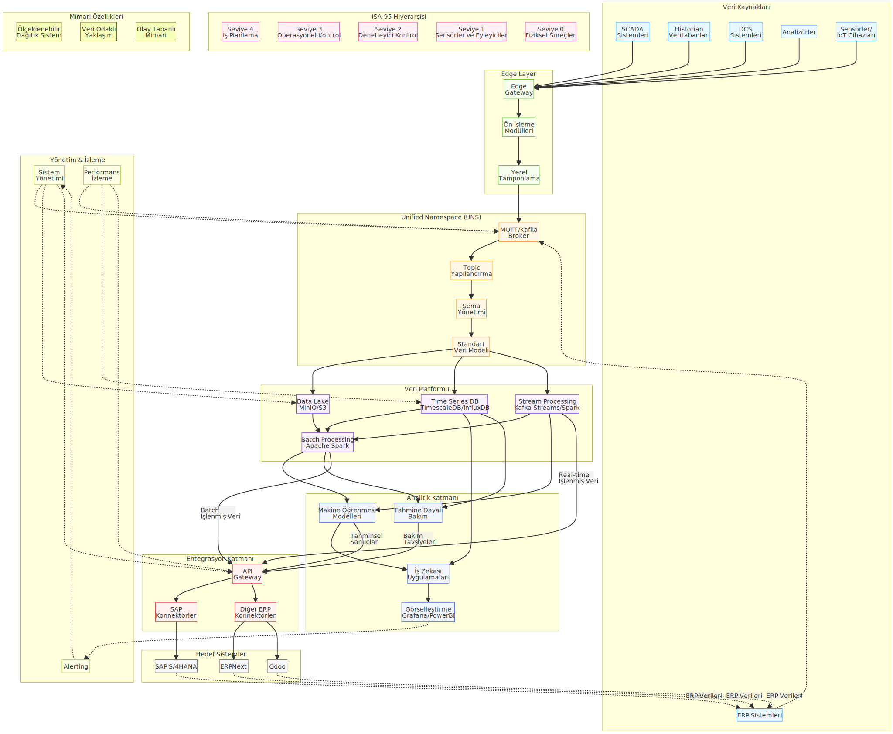

# ManufactBridge: Modern Üretim-ERP Veri Platformu

ManufactBridge, endüstriyel üretim sistemlerinden (SCADA, Historian, DCS, analizörler) ve ERP sistemlerinden toplanan verileri **Unified Namespace (UNS)** yaklaşımıyla merkezi bir veri platformunda birleştiren modern bir veri mimarisidir. Geleneksel noktadan noktaya entegrasyonlar yerine, merkezi ve standartlaştırılmış bir veri modeli kullanarak ölçeklenebilir, tutarlı ve analitik odaklı bir yapı sunar.

## İçindekiler

- [Genel Bakış](#genel-bakış)
- [Neden ManufactBridge](#neden-manufactbridge)
- [Temel Özellikler](#temel-özellikler)
- [Mimari](#mimari)
- [Kullanım Senaryoları](#kullanım-senaryoları)
- [Teknoloji Yığını](#teknoloji-yığını)
- [Kurulum](#kurulum)
- [ERP Entegrasyonu](#erp-entegrasyonu)
- [Güvenlik](#güvenlik)
- [Dokümantasyon](#dokümantasyon)
- [Katkı Sağlama](#katkı-sağlama)
- [Lisans](#lisans)
- [İletişim](#iletişim)

## Genel Bakış

ManufactBridge, endüstriyel üretim verilerini ERP sistemleriyle entegre eden ve standart bir veri modeliyle birleştiren kapsamlı bir veri platformudur. Üretim sistemlerinden toplanan verileri toplu bir şekilde işleyerek anlamlı içgörülere dönüştürür ve karar verme süreçlerini iyileştirir.

## Neden ManufactBridge

- **Unified Namespace (UNS):** Bir merkezi veri alanında tüm sistemlerin verilerini paylaştığı pub/sub temelli yaklaşım ile veri siloları ortadan kaldırılır
- **Tek Gerçek Kaynağı:** Tüm veriler ve bilgiler için tek bir gerçek kaynağı sağlayan mimarisi ile veri tutarlılığı
- **Kapsamlı Veri Platformu:** Data Lake, Time Series DB ve Stream Processing ile zengin analitik imkanları
- **İleri Analitik:** Yapay zeka ve veri analizi için hazır altyapı 
- **Akıllı ERP Entegrasyonu:** Yalnızca anlamlı, işlenmiş verilerin ERP sistemlerine aktarımı
- **Güvenli Mimari:** Katmanlı güvenlik yaklaşımı ve endüstriyel standartlara uygun veri koruma

## Temel Özellikler

- **ISA-95 Tabanlı UNS Hiyerarşisi:** ISA-95 seviyeleri kullanarak kurumsal hiyerarşi yapısı
- **MQTT/Kafka Tabanlı Mesajlaşma:** Ölçeklenebilir, gerçek zamanlı veri aktarımı
- **Standart Veri Modelleri:** Sparkplug B spesifikasyonu ile zenginleştirilmiş veri modelleme
- **Data Lake Mimarisi:** Yapılandırılmış ve yapılandırılmamış verilerin merkezi deposu
- **Zaman Serisi Veritabanı:** Sensör ve makine verilerinin verimli depolanması
- **Stream Processing:** Gerçek zamanlı veri işleme ve dönüştürme yeteneği
- **Edge Computing Desteği:** Kaynak noktasında veri ön işleme
- **Yapay Zeka Entegrasyonu:** Verileri temizlemek ve normalleştirmek için yapay zeka kullanımı
- **Çift Yönlü ERP Entegrasyonu:** ERP verilerinin de UNS'ye dahil edilmesi
- **Konteynerize Dağıtım:** Kubernetes/Docker ile kolay kurulum
- **Dayanıklı Mimari:** Hata toleransı ve yüksek erişilebilirlik

## Mimari

ManufactBridge, katmanlı ve modüler bir mimari yapı kullanarak endüstriyel verilerden değer üretmeyi amaçlar. Bu mimarinin temelinde Unified Namespace (UNS) prensibi yer alır ve tüm veri akışları bu merkezi veri alanından geçer.

### Mimari Bileşenler ve Veri Akışı

Aşağıdaki diyagram, ManufactBridge'in temel mimari bileşenlerini ve bunlar arasındaki veri akışını göstermektedir:

```
+---------------------+      +------------------------+      +--------------------+
|                     |      |                        |      |                    |
|  VERİ KAYNAKLARI    |      |  EDGE COMPUTING        |      |  UNS KATMANI       |
|                     |      |                        |      |                    |
|  SCADA Sistemleri   |      |  Veri Toplama          |      |  MQTT/Kafka Broker |
|  Historian Verileri +----->+  Ön Filtreleme         +----->+  Topic Yönetimi    |
|  IoT Sensörleri     |      |  Protokol Dönüşümü     |      |  Veri Şemaları     |
|  PLC/DCS Sistemler  |      |  Yerel Önbellek        |      |  Sparkplug B       |
|  ERP/MES Sistemleri |      |  Bağlantı Yönetimi     |      |  ISA-95 Hiyerarşisi|
|                     |      |                        |      |                    |
+---------------------+      +------------------------+      +---------+----------+
                                                                       |
                                                                       |
                                                                       v
+---------------------+      +------------------------+      +--------------------+
|                     |      |                        |      |                    |
|  ERP SİSTEMLERİ     |      |  ENTEGRASYON KATMANI   |      |  VERİ PLATFORMU    |
|                     |      |                        |      |                    |
|  SAP S/4HANA        |      |  API Gateway           |      |  Data Lake         |
|  ERPNext            +<-----+  Mesaj Dönüşümü        +<-----+  Time Series DB    |
|  Odoo               |      |  İş Akışı Yönetimi     |      |  Stream Processing |
|  Legacy Sistemler   |      |  Hata Yönetimi         |      |  Batch Processing  |
|                     |      |  Veri Filtreleme       |      |                    |
|                     |      |                        |      |                    |
+---------------------+      +------------------------+      +---------+----------+
                                                                       |
                                                                       |
                                                                       v
                                                              +--------------------+
                                                              |                    |
                                                              |  ANALİTİK KATMANI  |
                                                              |                    |
                                                              |  Makine Öğrenmesi  |
                                                              |  Tahminsel Bakım   |
                                                              |  İş Zekası         |
                                                              |  Görselleştirme    |
                                                              |                    |
                                                              +--------------------+
```

### Katmanlar ve İşlevleri

ManufactBridge mimarisi aşağıdaki temel katmanlardan oluşur:

1. **Edge Connectors Katmanı**: Üretim sistemleri ve diğer veri kaynaklarından verileri toplayan konnektörler
2. **Unified Namespace Katmanı**: Tüm verilerin ortak bir yapıda paylaşıldığı merkezi mesajlaşma katmanı
3. **Veri Platformu Katmanı**: Verilerin işlendiği, depolandığı ve yönetildiği temel platform
4. **Analitik Katmanı**: Makine öğrenmesi ve görselleştirme için araçlar sunan analitik ortamı
5. **Entegrasyon Katmanı**: ERP sistemleri ve diğer kurumsal sistemlerle entegrasyonu sağlayan katman
6. **Güvenlik Katmanı**: Tüm sistemin güvenliğini sağlayan kimlik doğrulama ve yetkilendirme mekanizmaları
7. **Dayanıklılık Katmanı**: Sistem hatalarına karşı tolerans sağlayan ve kendini onaran mekanizmalar
8. **Yönetim Katmanı**: Tüm sistemin izlenmesi ve yönetilmesi için araçlar sunan katman

### Detaylı Mimari Diyagramı



### Dosya Yapısı

ManufactBridge kodları aşağıdaki yapıda organize edilmiştir:

```
/src
├── /EdgeConnectors            # Üretim sistemlerinden veri toplama modülleri
│   ├── /SCADA                 # SCADA sistemleri için konnektörler
│   ├── /Historian             # Historian sistemleri için konnektörler  
│   ├── /DCS                   # Dağıtık kontrol sistemleri için konnektörler
│   ├── /Analyzers             # Üretim analizörleri için konnektörler
│   └── /ERP                   # ERP sistemleri için konnektörler
├── /UnifiedNamespace          # Merkezi veri paylaşım sistemi (UNS)
│   ├── /Broker                # MQTT/Kafka mesaj aracı
│   ├── /Schema                # Veri şema yönetimi ve doğrulama
│   ├── /Sparkplug             # Sparkplug B spesifikasyonu desteği
│   └── /ISA95                 # ISA-95 tabanlı hiyerarşi yapısı
├── /DataPlatform              # Merkezi veri platformu
│   ├── /DataLake              # Yapılandırılmamış veri depolama (MinIO/S3)
│   ├── /TimeSeriesDB          # Zaman serisi veritabanı (InfluxDB/TimescaleDB)
│   ├── /StreamProcessing      # Gerçek zamanlı veri işleme (Kafka Streams)
│   └── /BatchProcessing       # Toplu veri işleme (Apache Spark)
├── /Analytics                 # Analitik işlem modülleri
│   ├── /ML                    # Makine öğrenmesi bileşenleri
│   ├── /AI                    # Yapay zeka ve ajansal yapılar
│   ├── /PredictiveMaintenance # Kestirimci bakım modülleri
│   └── /Visualization         # Görselleştirme araçları (Grafana/PowerBI)
├── /IntegrationLayer          # Sistem entegrasyonları
│   ├── /ERPConnectors         # ERP bağlantıları
│   │   ├── /SAP               # SAP S/4HANA bağlantıları
│   │   ├── /OpenSource        # Açık kaynak ERP bağlantıları
│   │   └── /Legacy            # Eski sistem entegrasyonları
│   ├── /API                   # RESTful ve GraphQL API'ler
│   ├── /MessageBrokers        # Mesaj aracıları (Kafka/RabbitMQ)
│   ├── /DataTransformation    # Veri dönüşüm servisleri
│   ├── /Orchestration         # Entegrasyon iş akışları
│   └── /ErrorHandling         # Hata yönetimi ve telafi mekanizmaları
├── /SecurityLayer             # Güvenlik ve kimlik doğrulama katmanı
│   ├── /Authentication        # Kimlik doğrulama servisleri
│   ├── /Authorization         # Yetkilendirme ve erişim kontrolü
│   ├── /Encryption            # Veri şifreleme servisleri
│   ├── /Audit                 # Denetim ve log izleme
│   └── /ThreatDetection       # Anormal durum tespiti
├── /ResilienceLayer           # Dayanıklılık ve hata yönetimi
│   ├── /CircuitBreakers       # Devre kesici mekanizmalar
│   ├── /Retry                 # Yeniden deneme stratejileri
│   ├── /Fallback              # Alternatif işlem mekanizmaları
│   ├── /Monitoring            # Hata izleme
│   └── /Recovery              # Veri ve sistem kurtarma
└── /ManagementLayer           # Sistem yönetimi ve izleme
    ├── /SystemManagement      # Sistem yönetimi
    ├── /PerformanceMonitoring # Performans izleme
    ├── /Alerting              # Alarm yönetimi
    └── /Dashboards            # İzleme panoları
```

## Kullanım Senaryoları

- **Gerçek Tek Veri Kaynağı:** Tek veri gerçeği, modern Endüstri 4.0'ın merkezinde yer alan UNS yapısı
- **Önleyici Bakım:** Makinelerin gerçek zamanlı sağlık durumu izleme ve kestirimci bakım
- **Kalite Analitiği:** Üretim hataları, kalite sapmaları ve kök neden analizleri
- **Üretim Optimizasyonu:** Üretim performansı, enerji tüketimi ve kaynak kullanımı optimizasyonu
- **İzlenebilirlik:** Tüm ürün yaşam döngüsü boyunca malzeme ve süreç izlenebilirliği
- **Tedarik Zinciri Senkronizasyonu:** Tedarik zinciri planlaması ve gerçek zamanlı üretim durumu entegrasyonu
- **Karar Destek Sistemleri:** Üretimle ilgili kararların veri odaklı bir şekilde alınması

## Teknoloji Yığını

- **Mesajlaşma:** Apache Kafka / HiveMQ MQTT
- **Veri Depolama:** MinIO (S3 uyumlu) / Azure Data Lake / AWS S3
- **Zaman Serisi DB:** InfluxDB / TimescaleDB
- **Stream Processing:** Apache Kafka Streams / Apache Spark Streaming
- **Batch Processing:** Apache Spark / Hadoop
- **Konteynerleme:** Docker / Kubernetes
- **Görselleştirme:** Grafana / PowerBI
- **Entegrasyon Araçları:** Apache NiFi / MaestroHub / HighByte Intelligence Hub
- **Güvenlik Araçları:** Keycloak / Vault / OPA (Open Policy Agent)
- **İzleme Araçları:** Prometheus / Grafana Alerts / ELK Stack

## Kurulum

```bash
# Repository'yi klonlayın
git clone https://github.com/ManufactBridge/ManufactBridge.git
cd ManufactBridge

# Ortam değişkenlerini yapılandırın
cp .env.example .env
# .env dosyasını düzenleyin

# Kubernetes deployment başlatın
kubectl apply -f kubernetes/

# Alternatif olarak Docker Compose kullanın
docker-compose up -d
```

Platformu başlatmak için:

```bash
# Docker Compose ile UNS ve veri platformunu başlatın
docker-compose -f docker-compose.uns-platform.yml up -d

# Kubernetes ile başlatmak için
kubectl apply -f kubernetes/uns-platform/
```

Erişim noktaları:
- UNS Dashboard: http://localhost:1883 (MQTT WebUI)
- Kafka Yönetim: http://localhost:9000 (Kafdrop)
- Veri Analitik: http://localhost:3000 (Grafana)
- İş Zekası: http://localhost:8088 (Superset)
- Sistem Yönetimi: http://localhost:9090 (Prometheus)
- Güvenlik İzleme: http://localhost:5601 (Kibana)

## ERP Entegrasyonu

ManufactBridge, geleneksel ERP entegrasyonlarının ötesine geçerek, modern bir endüstriyel veri platformu üzerinden akıllı ERP entegrasyonu sağlar.

### Geleneksel vs. Modern ERP Entegrasyonu

| **Geleneksel Yaklaşım** | **ManufactBridge UNS Yaklaşımı** |
|------------------------|----------------------------|
| Doğrudan veri aktarımı | Veri platformu üzerinden akıllı entegrasyon |
| ERP sisteminde yüksek veri yükü | Yalnızca işlenmiş, anlamlı verilerin aktarımı |
| Sınırlı ölçeklenebilirlik | Dağıtık, ölçeklenebilir mimari |
| Erişilemeyen analitik imkanlar | Daha hızlı anomali tespiti ve daha iyi analitik ve raporlama |
| Noktadan noktaya entegrasyonlar | Merkezi bir veri havuzunda birleştirilmiş veri |
| Veri format sorunları | Standart veri modelleri ile veri uyumluluğu |
| Güvenlik zafiyetleri | Katmanlı güvenlik ve erişim kontrolü |
| Hata kurtarma zorlukları | Dayanıklı ve kendini onaran mimari |

### ERP Entegrasyon Aşamaları

1. **Veri Toplama:** Üretim, IoT ve diğer kaynaklardan veri toplama
2. **Ön İşleme:** Edge katmanında veri filtreleme ve temizleme
3. **UNS'ye Aktarım:** Structured topic yapısı ile UNS'ye veri gönderimi 
4. **Veri Zenginleştirme:** Farklı kaynaklarla veri birleştirme
5. **Analitik İşlemler:** Tahmine dayalı bakım, kalite analizi vb.
6. **İş Kuralları:** İşletme mantığı ve karar motorları
7. **ERP Entegrasyonu:** İşlenmiş, anlamlı verilerin ERP'ye aktarımı
8. **Hata Toleransı:** Veri kaybını önleyen dayanıklı işlem mekanizmaları

## Güvenlik

ManufactBridge, endüstriyel sistemlerin güvenliği için katmanlı bir yaklaşım benimser:

1. **Kimlik Doğrulama:** OAuth 2.0 ve JWT tabanlı modern kimlik doğrulama
2. **Yetkilendirme:** Detaylı erişim kontrolü ve rol tabanlı güvenlik
3. **Şifreleme:** Veri aktarımı ve depolamada uçtan uca şifreleme
4. **Denetim:** Tüm sistem erişimleri ve veri değişikliklerinin kayıt altına alınması
5. **Tehdit Tespiti:** Anormal davranış algılama ve otomatik müdahale

## Dokümantasyon

ManufactBridge projesi aşağıdaki dokümantasyonları içerir:

- **Detaylı Kullanım Kılavuzları**: Tüm kullanıcı rehberleri ve entegrasyon dökümanları için [docs/README.md](docs/README.md) dosyasına bakın.
- **Kaynak Kod Yapısı**: Tüm modül ve bileşenlerin detaylı açıklamaları için [src/README.md](src/README.md) dosyasına bakın.
- **Katkı Sağlama Rehberi**: Projeye katkıda bulunmak için [CONTRIBUTING.md](CONTRIBUTING.md) dosyasına bakın.

Tam dokümantasyon için [docs/README.md](docs/README.md) klasörüne bakın.

## Katkı Sağlama

Projeye katkıda bulunmak için:

1. Bu repository'yi fork edin
2. Yeni bir branch oluşturun (`git checkout -b feature/amazing-feature`)
3. Değişikliklerinizi commit edin (`git commit -m 'Add some amazing feature'`)
4. Branch'inizi push edin (`git push origin feature/amazing-feature`)
5. Pull Request açın

Katkı sağlama rehberimiz için [CONTRIBUTING.md](CONTRIBUTING.md) dosyasına bakın.

## Lisans

Bu proje MIT Lisansı altında lisanslanmıştır - detaylar için [LICENSE](LICENSE) dosyasına bakın.

**ÖNEMLİ NOT:** Bu proje, SAP SE'nin resmi bir ürünü değildir. SAP S/4HANA entegrasyonu için, geçerli SAP lisanslarına sahip olmanız gerekmektedir. SAP API ve sistemlerinin kullanımı, SAP lisans koşullarına tabidir.


